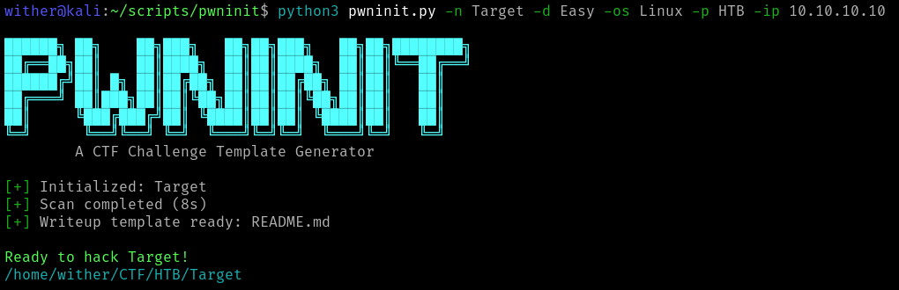

# pwninit - A CTF Challenge Template Generator

A simple Python tool that automates CTF challenge setup.



## Features

- Automatically creates a folder and subfolders for each challenge to organise your hacking.
- Generates a Markdown writeup template with nmap results.
- Multi-platform support.
- Optional verbosity levels.

## Installation

### Prerequisites
- Python 3.8 or higher
- nmap (for network scanning)

### Install nmap
```bash
# Ubuntu/Debian
sudo apt install nmap

# macOS
brew install nmap

# Windows
# Download from https://nmap.org/download.html
```

### Install pwninit
```bash
# Clone the repository
git clone https://github.com/wither/pwninit.git
cd pwninit

# Make executable
chmod +x pwninit.py

# Optional: Add to PATH
sudo ln -s $(pwd)/pwninit.py /usr/local/bin/pwninit
```

## Usage

### Basic Usage
```bash
./pwninit.py -n "Box Name" -ip 10.10.10.1 -d Easy -os Linux -p HTB
```

### Command Line Options

#### Required Arguments
- `-n, --name`: Challenge name (e.g., "Lame", "Blue")
- `-ip, --target-ip`: Target IP address
- `-d, --difficulty`: Difficulty level (Easy, Medium, Hard)
- `-os, --operating-system`: Target OS (Linux, Windows)
- `-p, --platform`: CTF platform (HTB, THM)

#### Optional Arguments
- `--no-scan`: Skip nmap scan (faster)
- `-q, --quiet`: Quiet mode - minimal output
- `-v, --verbose`: Verbose mode - detailed output
- `--version`: Show version information

## Directory Structure

pwninit will create the following directory structure:

```
~/CTF/<platform>/<challenge_name>/
├── README.md      # Generated writeup template
├── files/          # For challenge files
├── images/        # For screenshots
└── nmap/          # For nmap scan results (XML, nmap, gnmap)
```

## Writeup Template

The generated README.md template includes:

```markdown
# Name

**IP:** 
**Platform:**  
**Difficulty:**  
**OS:** 
**Date:** 

## Summary

## Reconnaissance

| Port | Service | Version |
|------|---------|---------|
|  |  |  |

## Enumeration

## Exploitation

## Privilege Escalation

## Flags

**User:** `user.txt`  
**Root:** `root.txt`

## Notes

```

## Contributing

Contributions are welcome. 
